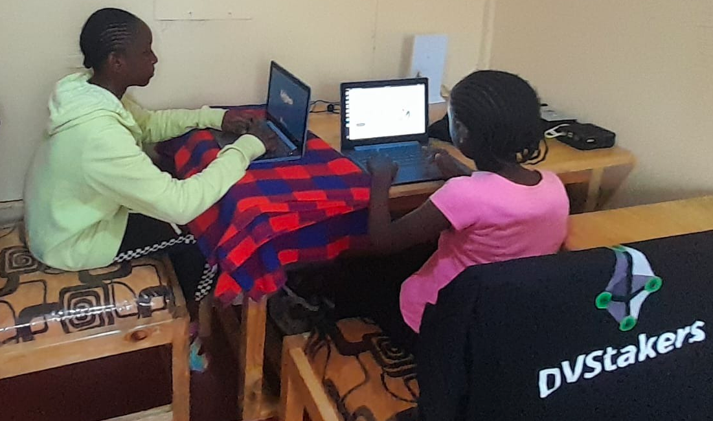

# 🇰🇪 Kenya Node - Phase 2

In [Kenya Node - Phase 1](kenya-node.md) an Ethereum full node, validator, and DVT validators were set up in an office in Nairobi, Kenya 🇰🇪

Phase 2 was pitched on a Lido Node Operator [Community Call](https://twitter.com/LidoFinance/status/1694266564642562100) and a [grant proposal](https://research.lido.fi/t/dvstakers-grant-proposal/5346) was submitted to Lido LEGO requesting funds for this project.

<figure><figcaption>
<a href="https://twitter.com/LidoFinance/status/1694266564642562100">https://twitter.com/LidoFinance/status/1694266564642562100</a>
</figcaption></figure>

With the [funds awarded](https://research.lido.fi/t/dvstakers-grant-proposal/5346/4) by Lido LEGO in October 2023, Phase 2 could begin!

## Phase 2 Goal

> **To set up a fully off-the-grid Ethereum validator in a rural village in Kenya, supporting the local community through education.**

<figure><figcaption>
Kenya node location
</figcaption></figure>

## Preparation

The location chosen for the machines was a house located near the base of Kilimanjaro in Western Kenya. As the home of a local community leader of the Massai tribe, it was an ideal choice for setting up the infrastructure and equipment.

<figure><figcaption>
A family of new Ethereum stakers
</figcaption></figure>

Before DVStakers traveled to Kenya to move the existing equipment from Nairobi several preparation steps were required:

1. Solar panels
2. Batteries
3. Starlink Internet
4. Site Security

<figure><figcaption>
Site layout
</figcaption></figure>

All the equipment used at the property (excluding the staking machines and laptops) was locally sourced.&#x20;

<figure><figcaption>
Local equipment sourcing
</figcaption></figure>

### Solar Panels

While some electricity is available at the property through the mains powerline, this power is intermittent, and regular power cuts lasting a few hours to a few days are common. The solar panels provide a cheap, clean source of power for the machines and power for the family in their home. The panels were installed at the property by local engineers.


350W x 5 panels = 1,755W


<figure><figcaption>
Solar panel installation
</figcaption></figure>

<figure><figcaption>
Solar panels completed (chickens included 🐓)
</figcaption></figure>

### Batteries

Having reliable solar power is a great start, but the staking machines need to be online 24-7 so power storage was needed. Batteries were installed inside the property to provide consistent power at night and during less sunny periods.


12v batteries x 4

3kW inverter


<figure><figcaption>
Battery installation
</figcaption></figure>

### Starlink Internet

Kenya has a very good mobile internet network that is widely available and reasonably priced. However, for the amount of data needed for an Ethereum full node, faster internet was required. Starlink became active in Kenya in[ July 2023](https://twitter.com/Starlink/status/1681287681341542400), so the timing was perfect for this project!


Equipment cost: 92,100 KSH (\~$570 USD)

Monthly subscription: 6,500 KSH per month (\~$40 USD)


<figure><figcaption>
Starlink arrives!
</figcaption></figure>

<figure><figcaption>
Starlink mounted on the roof of the house
</figcaption></figure>

A concern about using Starlink is the high latency which can have a significant negative impact when running validator nodes, particularly DVT nodes. But latency isn't a "fixed" value and changes due to a number of factors including the number of available satellites, weather, age of satellites, etc.

This screenshot shows a snapshot of a speed test conducted when Starlink was installed. The plan is to continually monitor the speed and latency to see how it changes over time. SpaceX also plans to launch more satellites over 2024 which should further lower latency.

<figure><figcaption>
Starlink speed test
</figcaption></figure>

### Site Security

With the addition of solar panels and Starlink to the property, consideration was given to the security of the site. While the area is generally very safe, improving the security by upgrading the fence provided protection from both people and animals. It's not uncommon for elephants in the area to break through weak fences and damage properties!

<figure><figcaption>
Upgraded fence at the property
</figcaption></figure>

## Setup

The equipment was moved from Nairobi by car to its new location, a drive of around 4 hours.

<figure><figcaption>
Previous office setup in Nairobi
</figcaption></figure>

<figure><figcaption>
Driving from Nairobi to the new location
</figcaption></figure>

A dedicated room was available for the equipment which also housed the batteries and solar converter.

<figure><figcaption>
Equipment setup begins
</figcaption></figure>

One of the staking machines required a reinstallation of Linux, so it was a perfect opportunity to give a demonstration for the family showing them what's running on the machines.

<figure><figcaption>
Linux installtion demonstration
</figcaption></figure>

Experiencing local cultures through food was a highlight of the setup experience.

<figure><figcaption>
Taking a break for lunch
</figcaption></figure>

The actual setup of the machines was pretty quick, taking only a few hours to connect all the devices, check everything was working as expected, and install the operating systems.

<figure><figcaption>
The finished setup
</figcaption></figure>

The two laptops are used to provide access to the staking machines, local monitoring and are also used by the family and community school for learning and lesson planning.

<figure><figcaption>
Setup explained
</figcaption></figure>

### Starlink

This is the router component of the Starlink setup. By default, the Starlink base station is WiFi only, but [an adapter](https://www.starlinkhardware.com/starlink-ethernet-adapter-setup-and-review/) can be purchased to allow an Ethernet cable to be used as well. This was then integrated with a simple network adaptor to allow all the machines to use a wired Ethernet connection for more stable operations.

### Homenode (full node)

A full node [Homenode machine](https://homenode.org/?page\_id=157).

* 32GB RAM
* 2TB NVMe SSD

This machine uses passive heatsync cooling which means it can get very hot. It's been running in Kenya for over 6 months already with an Ethereum mainnet and Goerli chain using Dappnode software and it's operated flawlessly.

### Homenode (mini-node)

This mini-node created by [Homenode](https://homenode.org/) is an experimental machine that is low cost \~$200 and can be used to run Dappnode software. It doesn't have a large SSD so can't run a full chain on its own, but is being trialed as a DVT node connected to the other full nodes also in Kenya. While there are concerns raised about the reliance on the full node reducing the redundancy, it allows for a wider range of use cases such as multiple homes running the DVT validation all over a single Starlink connection that has limited bandwidth. Testing this machine has only just begun, but it's looking very promising!

* 4GB RAM
* 64GB SSD

### Dappnode

This is a top-spec[ Dappnode machine](https://dappnode.com/en-gb/collections/all/products/home-i564-4n) provided by [Dappnode](https://twitter.com/DAppNode). Running Dappnode software was super intuitive and easy to show the local community how to get started with Ethereum validators. This model contains a fan so the heat concerns are minimal.

* 64GB RAM
* 4TB NVMe SSD

## Challenges

### Physical

One of the main physical challenges with this project was transport and access to the site. While many of the main roads in Kenya are paved, access to the smaller villages, particularly during the rainy season can be difficult. Once everything was set up, remote access to the machines meant that direct access to the site wasn't needed every day, which was helpful as a number of days the road became impassable.

<figure><figcaption>
The roads on a dry day...
</figcaption></figure>

<figure><figcaption>
and on a wet day!
</figcaption></figure>

<figure><figcaption>
Getting rescued can take a while
</figcaption></figure>

The temperature is also a concern as during the hottest periods the temperature in the room with the computer equipment could get to 35C or higher. Mitigations are planned such as passive vent cooling towers through the roof as well as fans. As a last resort a small electrical air conditioning unit can be purchased but this hopefully can be avoided.

### Technical

Starlink only uses IPV6. This is a problem as Ethereum P2P networks use IPV4. What does that mean in practice? There's no way to open ports directly to the machines, which means that they can't be fully participating nodes right now.

Can the node still follow the chain? Yes, but only by listening to other machines that do have open ports. This also makes it slower to find peers as it's the equivalent of running a normal node with all incoming external ports closed.

Can the node still perform validator duties? Yes, but it can only broadcast to the network to nodes that do have open ports.

Direct access to the machines was a concern, but using [ZeroTier VPN](https://www.zerotier.com/pricing/) made access possible over any connection remotely.

DVT validators may find the increased latency of Starlink and the lack of IPV4 support a particular challenge due to the lower latency requirements of DVT consensus. This is the main concern about this configuration and something that will be closely monitored over the coming months.

## What's running on the machines?

With the equipment set up, here's what's running on the machines:

### Ethereum full node

Full nodes are important to the Ethereum network. Even without [open ports](kenya-node-phase-2.md#technical), storing the whole chain and submitting transactions locally are important to the decentralization of Ethereum. A full mainnet node uses a significant amount of bandwidth (\~1TB per month) which means that only one full node is being run over the single Starlink connection.

### Etherfi Operation Solo Staker

[Ether.fi](kenya-node-phase-2.md#etherfi-operation-solo-staker) Operation Solo Staker enables anyone to run nodes, further decentralizing the Ethereum network. The current rewards are \~$30 per month which is a non-trivial amount for the Kenyan stakers involved in this initiative.

These DVT validators are running [Obol](https://obol.tech) clusters.

### SSV Operator

For testing DVT over Starlink an [SSV](https://ssv.network/) operator has been created on Holesky. This is being actively monitored to test performance.

### Future Lido Simple DVT Trial Participant 🤞

While not currently participating in the Lido [Simple DVT](https://blog.lido.fi/leveraging-distributed-validator-technology/) trials the hope is that the nodes will be performant enough to be able to actively participate in future trials. Testing and monitoring over the coming weeks and months will be used as evidence to show performance.

## Local Community

Setting up the equipment and running the Ethereum validators are only part of the initiative. A significant emphasis has been placed on supporting and educating the local community about crypto, Ethereum, and staking.

<figure><figcaption>
Rural farmland outside the node house
</figcaption></figure>

<figure><figcaption>
The local village
</figcaption></figure>

<figure><figcaption>
Kilimanjaro viewed from the hotel window
</figcaption></figure>

<figure><figcaption>
Wildebeests roaming through the fields
</figcaption></figure>

Related to the Phase 2 initiative, with the improved fencing around the property, a chicken coop and garden were set up to provide food for the family.

<figure><figcaption>
Solo staker chickens 🐓
</figcaption></figure>

<figure><figcaption>
Community staker garden 🌱
</figcaption></figure>

The internet and power setup for the validator nodes can also be used by the local school and community. The laptops and internet are being used for lesson planning and management spreadsheets for the administrators. The staking rewards being earned through [Ether.fi](https://www.ether.fi/solo-staker) Operation Solo Staker are being used to pay for free school lunches for over 80 children.

<figure><figcaption>
A local school supported by DVStakers and DVT
</figcaption></figure>

So what does Phase 3 look like? There's certainly a lot of opportunity to grow the Kenyan staking community and improve local infrastructure. If anyone has any suggestions or ideas for what DVStakers could do next please join the [Discord](https://discord.gg/VbVwqgSdFD) to discuss 🙂

<figure><figcaption>
A solo giraffe 🦒
</figcaption></figure>

## Supporter Thanks 🙏

This initiative was made possible by support from [Lido](https://twitter.com/LidoFinance), [Dappnode](https://twitter.com/DAppNode), [Homenode](https://twitter.com/Homenodeorg), [Ether.fi](https://twitter.com/ether\_fi), the [EF](https://twitter.com/ethereum), [Obol](https://twitter.com/ObolNetwork), [SSV](https://twitter.com/ssv\_network), and many others. It wouldn't have been possible without all of this help so it is hugely appreciated!

[Eridian](https://twitter.com/EridianAlpha) coordinated this project as the DVStakers member on the ground supporting the setup.

<figure><figcaption>
Solo Stakers Eridian and Steven
</figcaption></figure>
