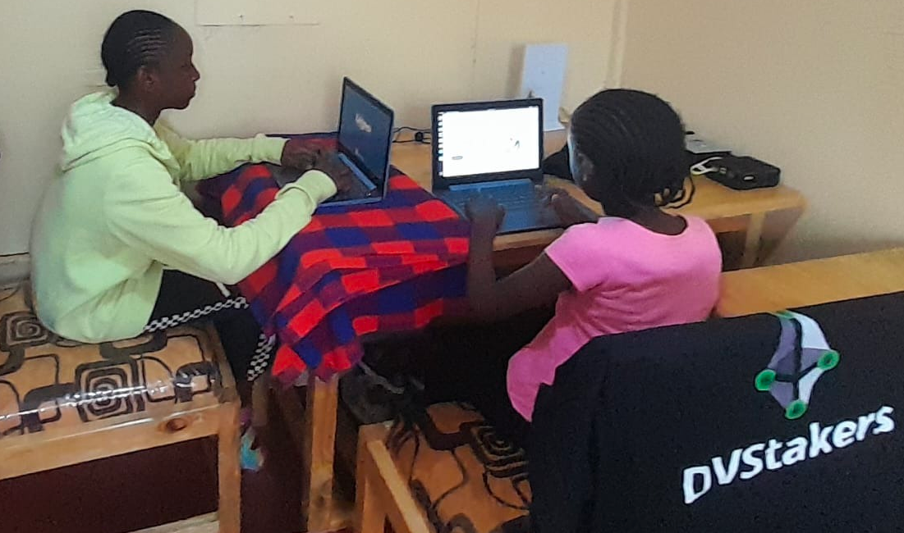
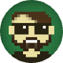

# 🇰🇪 Kenya Node

<figure><figcaption>
DVStakers Global - Kenya Node Location
</figcaption></figure>

<figure><figcaption>
DVStakers Kenya Node - Webcam View
</figcaption></figure>

### About the Kenyan Node

Everyone knows that the continued decentralization of Ethereum is critical, and DVStakers wanted to do something about it.

Through personal contacts in Kenya, we arranged a small office space in Nairobi to set up a proof of concept node operator.

DVStakers is a distributed node operator community providing education about DVT, so it seemed like a perfect fit for our vision.

This setup is not the final version but simply a 3-day proof of concept to show Ethereum DVT validators running in Kenya.

Special thanks to [Dappnode](https://dappnode.com/) and [HomeNode](https://homenode.org/) who provided the node hardware for this initiative.

### What's running on the nodes?

🏗️ Content coming soon™ 🏗️

### Setup process

We arrived in Nairobi and went to source local equipment.

.png>).png>)

.png>)

With all the equipment sourced, we started setting everything up.

<figure><figcaption></figcaption></figure>

The building has a backup generator for long power cuts, but a UPS was very useful for short 1-2 second power fluctuations that would have caused the nodes to turn off.

<figure><figcaption></figcaption></figure>

Networking was the biggest challenge to ensure everything was set up to allow remote connections.

<figure><figcaption></figcaption></figure>

The final setup:

<figure><figcaption></figcaption></figure>

The setup team:

<figure><figcaption>
Eridian &#x26; James
</figcaption></figure>

### Supported By

<figure><figcaption>
Eridian
</figcaption></figure>

 

<figure><figcaption>
Spacesider
</figcaption></figure>

 

<figure><figcaption>
Snapcrackle
</figcaption></figure>

