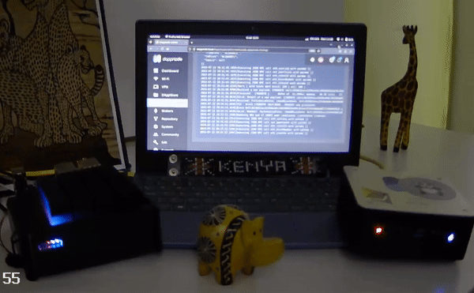

# 🇰🇪 Kenya Node - Phase 1

<figure><figcaption>
DVStakers Kenya Node - Webcam View
</figcaption></figure>

<figure><figcaption>
DVStakers Kenya Node - Webcam View
</figcaption></figure>

### About the Kenyan Node

**Why Kenya?**&#x20;

DVStakers operate nodes in Australia, Germany, the UK, and the USA, effectively covering the current geographical demographics of node distribution.&#x20;

Everyone knows that the continued decentralization of Ethereum is critical, and DVStakers wanted to do something about it.

We wanted to showcase the global reach of DVT and decided to expand our presence to Africa.  DVStakers is a distributed node operator community providing education about DVT, so it seemed like a perfect fit for our vision.

Navigating through this mission was not without its challenges. Our exhaustive two-month exploration to identify an appropriate node operator did not yield the desired results. However, we remained unfazed and adopted the "build it, and they will come" approach.

Our approach was centred around identifying a community or a user interested in adopting our node.&#x20;

Among all the possible African nations, Kenya emerged as the most suitable destination for our expansion. The country was not random; we leveraged pre-existing relationships with Snapcrackle and Eridian.&#x20;

Furthermore, we were buoyed by the forthcoming ETH Safari in 2023, a global event anticipated to draw enthusiasts from across continents, thereby increasing Kenya's visibility in the crypto world in our quest to find a home for the nodes.&#x20;

As of now, DVStakers is remotely managing the node.&#x20;

The setting up process was not a smooth sailing journey; it threw a few unanticipated challenges our way.  We intend to delve into these challenges in a moment.&#x20;

Nonetheless, this experience underscored the need for detailed node guides to consider the distinct situations encountered in different regions around the globe. This way, we can mitigate such challenges in our future expansions and continue to broaden the reach of home stakers and DVT.

Special thanks to [Dappnode](https://dappnode.com/) and [HomeNode](https://homenode.org/), who provided the node hardware for this initiative and Duncan, who we met online and is helping us with physical IT operations in Nairobi.

This setup is not the final version but simply a 3-day proof of concept to show Ethereum DVT validators running in Kenya.

### What's running on the nodes?

* Geth & Lighthouse
* Nethermind & Prysm
* SSV Operator: [https://explorer.ssv.network/operators/615](https://explorer.ssv.network/operators/615)
* DVStakers Obol Cluster

### Setup process

We arrived in Nairobi and went to source local equipment. We could buy equipment cheaper or at the same price as back in Europe.

.png>).png>)

.png>)

With all the equipment sourced (we made several trips and would not have found many parts with the help of Duncan), we started setting everything up.

<figure><figcaption></figcaption></figure>

The building has a backup generator for long power cuts, but a UPS was very useful for short 1-2 second power fluctuations that would have caused the nodes to turn off.

<figure><figcaption></figcaption></figure>

Networking was the biggest challenge to ensure everything was set up to allow remote connections.

<figure><figcaption></figcaption></figure>

The final setup:

<figure><figcaption></figcaption></figure>

The setup team:

<figure><figcaption>
Eridian &#x26; James
</figcaption></figure>

